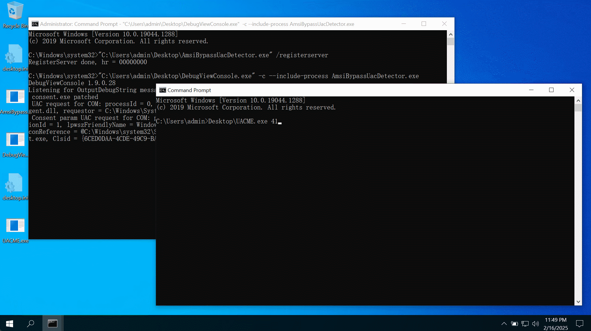

# AmsiBypassUacDetector

AmsiBypassUacDetector is a Proof of Concept (POC) tool that leverages the AMSI (Antimalware Scan Interface) to detect and block most BypassUAC techniques used in tools like UACME. It is designed for Windows 10 and later systems.



```
UAC request for COM: processId = 0, trustState = 0, autoElevate = 1, serverBinary = C:\Windows\System32\cmstplua.dll, requestor = C:\Windows\explorer.exe, clsid = {3E5FC7F9-9A51-4367-9063-A120244FBEC7}
Masqueraded process found: pid = 1348, commandLine = explorer.exe, imageFileName = \device\harddiskvolume3\users\admin\desktop\uacme.exe
UAC request for EXE: processId = 1472, trustState = 0, autoElevate = 1, applicationName = C:\Windows\system32\fodhelper.exe, commandLine = "C:\Windows\system32\fodhelper.exe" , dllParameter =
Masqueraded process found: pid = 1472, commandLine = explorer.exe, imageFileName = \device\harddiskvolume3\users\admin\desktop\uacme.exe
```

## Requirements

**Windows 10 or later**

The tool is theoretically compatible with all versions of Windows 10 and later. It has been tested and verified on Windows 10 1903, Windows 10 21H2, and Windows 11 24H2.

## Usage

1. **Register the POC in the system: `AmsiBypassUacDetector.exe /RegisterServer`**
2. **Use DebugView to listen `OutputDebugString` output.**
3. **Test BypassUAC techniques (e.g., using UACME).**

## How It Works

Most BypassUAC techniques exploits will masquerade the Process Environment Block (PEB), then create COM objects that allow automatic elevation, or launch OS built-in executables that allow automatic elevation. The `IAntimalwareUacProvider` interface provides a mechanism to synchronously inspect UAC elevation behaviors.

`IAntimalwareUacProvider` is a COM component interface available in Windows 10 and later. It must be registered as a LocalServer COM object within the system and additionally registered under the registry key `HKLM\SOFTWARE\Microsoft\AMSI\UacProviders\{CLSID}`.

When a UAC elevation is initiated, the requester asks the `appinfo` service to either launch an elevated executable or request an elevated token. In response, the `appinfo` service creates a `consent.exe` process to determine whether a prompt is necessary or if the elevation can be automatically approved. Regardless of the outcome, the `consent.exe` process utilizes the `AmsiUacScan` function from `amsi.dll` to perform a scan, during which the `IAntimalwareUacProvider` interface is instantiated and invoked.

Implementing the `IAntimalwareUacProvider` interface requires running in an AM-PPL (Antimalware Protected Process Light) level process, which is challenging to achieve. This POC automatically patches the `amsi!VerifyProtectionLevel` function within the `consent.exe` process to bypass this verification.

## Workaround for Pre-Windows 10 Versions

The following functionality is **not included** in the current POC:

In versions prior to Windows 10 (e.g., Windows 7), the `IAntimalwareUacProvider` interface is not available. However, the UAC mechanism operates similarly. By using a driver's process creation callback (`PsSetCreateProcessNotifyRoutine`), you can write code to inspect the command-line arguments of the `consent.exe` process and read internal structures (`CONSENTUI_PARAM_HEADER`) from the `appinfo` service. This approach allows you to gather the same information that the `IAntimalwareUacProvider` interface would provide.
